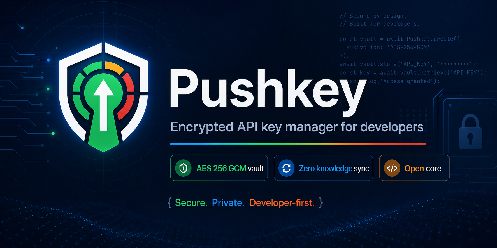

<div align="center">



<br/>

[](https://github.com/Push-Key/pushkey/releases)
[](https://www.npmjs.com/package/@pushkey/cli)
[](LICENSE)
[](https://python.org)
[](tests/)
[](#installation)

<br/>

> Pushkey stores, rotates, and injects your API keys using **AES-256-GCM** encryption with **Argon2id** key derivation —
> the same primitives used in password managers you already trust.
> The vault never writes plaintext to disk.
> The cloud sync backend is zero-knowledge: even we can't read your keys.

<br/>

[**⚡ Quick Start**](#-quick-start) · [**💻 CLI**](#-cli-reference) · [**🔐 Crypto**](#-vault-format--crypto) · [**✨ Features**](#-features) · [**🤝 Contribute**](#-contributing)

</div>

---

## 🤔 Why Pushkey

Most developers manage API keys in `.env` files, shell profiles, or their brain. That means:

| 😬 The problem | ✅ Pushkey fixes it |
|----------------|---------------------|
| Keys committed to git by accident | `inject` writes `.gitignore` guard first, every time |
| Keys shared over Slack in plaintext | Encrypted vault — share the vault, not the secret |
| No idea when `sk-abc123` was last rotated | Per-key rotation timestamps + health scoring |
| One key used across 6 projects | Multi-project assignment with per-env injection |
| No audit trail | Encrypted per-entry audit log with deterministic replay |

---

## ⚡ Quick Start

### Install

**via npm** *(recommended — works everywhere Node is installed)*
```bash
npm install -g @pushkey/cli
```

**via pip**
```bash
pip install pushkey
```

**via npx** *(no install needed)*
```bash
npx @pushkey/cli --help
```

**from source**
```bash
git clone https://github.com/Push-Key/pushkey.git
cd pushkey
pip install -r requirements.txt
```

### First run

```bash
# 1. Initialize your vault
pushkey init
# → Sets master password, generates PUSH-XXXX-XXXX-XXXX-XXXX recovery code (save it!)

# 2. Add a key
pushkey add OPENAI_API_KEY sk-abc123

# 3. Inject into your project
cd ~/my-project
pushkey inject
# → Writes .env, adds .env to .gitignore automatically

# 4. Or launch the GUI
python pushkey.py
```

> [!TIP]
> Set `PUSHKEY_MASTER` in your shell profile to skip the password prompt in scripts. Use a separate service account password — never your personal master password.

---

## 💻 CLI Reference

```
┌─────────────────────────────────────────────────────────────────┐
│  PUSHKEY CLI                                                     │
├────────────┬────────────────────┬───────────────────────────────┤
│  add       │ <NAME> [VALUE]     │ Store a key (--generate)      │
│  get       │ <NAME>             │ Print or copy (--clip)        │
│  list      │                    │ All keys + health status      │
│  rotate    │ <NAME> [VALUE]     │ Rotate to new value           │
│  delete    │ <NAME>             │ Remove a key                  │
│  status    │                    │ Vault health summary          │
│  inject    │                    │ Write to .env (--env prod)    │
│  import    │ <FILE>             │ Bulk import from .env file    │
│  assign    │ <NAME> <PATH>      │ Link key to a project         │
│  info      │ <NAME>             │ Full key metadata             │
│  history   │ <NAME>             │ Rotation history (--reveal)   │
│  log       │                    │ Audit log (--limit N)         │
│  passwd    │                    │ Change master password        │
│  init      │                    │ First-time vault setup        │
│  completion│ <bash|zsh|ps>      │ Shell completion script       │
└────────────┴────────────────────┴───────────────────────────────┘
```

**Common patterns:**

```bash
# 🏷️  Add a key — provider auto-detected from name/prefix
pushkey add STRIPE_SECRET_KEY sk_live_...

# 🎲  Generate a cryptographically random key
pushkey add MY_SIGNING_SECRET --generate

# 📋  Copy to clipboard without printing to terminal
pushkey get OPENAI_API_KEY --clip

# 🌍  Inject only production keys
pushkey inject --env prod

# 📥  Bulk import from an existing .env backup
pushkey import .env.backup

# 🐚  Add shell completion (bash example)
pushkey completion bash >> ~/.bashrc
```

---

## 🔐 Vault Format & Crypto

> 🔍 This section exists for the security community to audit. All crypto lives in [`pushkey_crypto.py`](pushkey_crypto.py).
> Full binary spec: [SECURITY.md](SECURITY.md)

### V3 Vault Layout

```
 ╔══════════════════════════════════════════════════════════╗
 ║  🪄  Magic       PK3\x00          4 bytes                ║
 ╠══════════════════════════════════════════════════════════╣
 ║  🧂  pw_salt     random           32 bytes  ─┐           ║
 ║  🧂  rec_salt    random           32 bytes   │ KDF inputs ║
 ╠══════════════════════════════════════════════════════════╣
 ║  🔑  pw_nonce    random           12 bytes  ─┐           ║
 ║      pw_ct       AES-GCM(vault_key, pw_key) 48 bytes  ─┘ ║
 ╠══════════════════════════════════════════════════════════╣
 ║  🆘  rec_nonce   random           12 bytes  ─┐           ║
 ║      rec_ct      AES-GCM(vault_key,rec_key) 48 bytes  ─┘ ║
 ╠══════════════════════════════════════════════════════════╣
 ║  📦  body_nonce  random           12 bytes  ─┐           ║
 ║      body_ct     AES-GCM(vault_key, JSON)  variable  ─┘  ║
 ╚══════════════════════════════════════════════════════════╝
```

**Two independent unlock paths — neither has access to the other's salt:**

```
🔑 Master password  →  Argon2id(pw, pw_salt)   →  vault_key  →  decrypt body
🆘 Recovery code    →  Argon2id(code, rec_salt) →  vault_key  →  decrypt body
```

The `vault_key` is a random 256-bit key created at vault init and never written to disk in plaintext. Changing your master password re-encrypts only the password slot — the recovery slot and vault body are untouched.

### Key Derivation

```python
# ✅ Argon2id — memory-hard, GPU-resistant (preferred)
Argon2id(secret=password, salt=salt, time=3, memory=64MB, parallelism=4, hash_len=32)

# ⬇️  PBKDF2-SHA256 fallback (if argon2-cffi not installed)
PBKDF2(password, salt, iterations=600_000)
```

### Vault Version History

| Version | Magic | Cipher | KDF | 🆘 Recovery |
|---------|-------|--------|-----|:-----------:|
| **V3** *(current)* | `PK3\x00` | AES-256-GCM | Argon2id | ✅ |
| V2 *(legacy)* | `PK2\x00` | AES-256-GCM | Argon2id | ❌ |
| V1 *(legacy)* | *(none)* | Fernet/AES-128-CBC | PBKDF2 | ❌ |

V2 and V1 vaults are auto-detected and migrated on first open — no action needed.

> [!IMPORTANT]
> The recovery code (`PUSH-XXXX-XXXX-XXXX-XXXX`) is shown **exactly once** at vault creation. Pushkey never stores it — not on disk, not in the cloud. Treat it like a seed phrase.

---

## ✨ Features

<table>
<tr>
<td width="50%">

**🔒 Encryption**
- AES-256-GCM vault — any tamper invalidates the MAC
- Argon2id KDF — 64 MB memory cost, GPU-resistant
- Independent recovery key slot (80-bit entropy)
- Atomic writes via `os.replace()` — no partial vault states
- Rolling backups (last 3 kept automatically)

**🔄 Key Management**
- Rotation tracking with full history per key
- Health scoring: 🟢 fresh / 🟡 aging / 🔴 critical
- Auto-tags 32+ providers by key name/prefix
- Env tiers: `dev` · `staging` · `prod` · `all`
- Bulk import from `.env` files

</td>
<td width="50%">

**💉 `.env` Injection**
- Always writes `.gitignore` guard before `.env`
- Per-project key assignment
- Per-env filtering on inject
- Drop zone for batch imports

**🖥️ Interface**
- Desktop GUI — dark/light themes, neon stat cards
- CLI with shell completion (bash/zsh/PowerShell)
- VS Code extension — health decorations in editor
- Chrome/Edge extension — live status in browser

**🔐 Auth & Sync**
- TOTP MFA (Google Authenticator compatible)
- FIDO2/YubiKey (Enterprise)
- Zero-knowledge cloud sync
- CI/CD push to GitHub Actions, Vercel, Netlify (Pro+)

</td>
</tr>
</table>

---

## 💼 Tier Comparison

<div align="center">

| Feature | 🆓 Free | 🚀 Starter | ⚡ Pro | 👥 Team | 🏛️ Enterprise |
|---------|:-------:|:----------:|:------:|:-------:|:-------------:|
| Keys | 15 | 50 | ∞ | ∞ | ∞ |
| Projects | 1 | 3 | ∞ | ∞ | ∞ |
| Devices | 1 | 1 | 3 | 5 | ∞ |
| ☁️ Cloud sync | ❌ | ✅ | ✅ | ✅ | ✅ |
| ⚡ CI/CD sync | ❌ | ❌ | ✅ | ✅ | ✅ |
| 🕵️ Git scan | ❌ | ✅ | ✅ | ✅ | ✅ |
| 👥 Team RBAC | ❌ | ❌ | ❌ | ✅ | ✅ |
| 🔐 TOTP MFA | ✅ | ✅ | ✅ | ✅ | ✅ |
| 🗝️ YubiKey MFA | ❌ | ❌ | ❌ | ❌ | ✅ |
| 🏛️ SSO (SAML/Okta) | ❌ | ❌ | ❌ | ❌ | ✅ |
| ⚙️ Dynamic secrets | ❌ | ❌ | ❌ | ❌ | ✅ |

</div>

<div align="center">

**[→ Get a license at pushkey.dev](https://pushkey.dev)**

</div>

---

## 🛡️ Security Controls

| Control | 🟢 What it does |
|---------|----------------|
| 🔑 **Master password** | Never stored — vault is cryptographically useless without it |
| 🔀 **Vault key isolation** | Random 256-bit key encrypts the body; password/recovery code never touch data directly |
| ✍️ **Atomic writes** | `.tmp` → `os.replace()` — no partial vault states possible |
| 🔒 **File permissions** | `vault.enc` and `.salt` set to `chmod 600` on write |
| 💾 **Rolling backups** | Last 3 vault snapshots at `~/.pushkey/vault_backup_*.enc` |
| 📵 **No plaintext on disk** | Vault, config, and audit log all encrypted at rest |
| 🙈 **`.gitignore` guard** | `inject` adds `.env` to `.gitignore` before writing, every time |
| 🌐 **Zero-knowledge cloud** | Server stores only ciphertext — no key material ever transmitted |

> [!WARNING]
> If you lose both your master password **and** your recovery code, your vault **cannot be recovered by anyone — including us**. Store your recovery code offline: paper copy, separate password manager, or safety deposit box.

---

## 🏗️ Architecture

```
~/.pushkey/
├── 🔐 vault.enc          AES-256-GCM encrypted vault (V3)
├── 🧂 .salt              32-byte random salt  (chmod 600)
├── ⚙️  config.json        AES-256-GCM encrypted project config
├── 📋 pushkey.log        Encrypted binary audit log
├── 📡 health.json        Public sidecar — health + timestamps, no secrets
├── 🪪 .license           AES-GCM encrypted tier token
├── 📲 .mfa               Encrypted TOTP secret
├── 🗝️  .fido2             FIDO2 credential blob
└── 📥 import/            Drop zone for bulk .env imports

pushkey/
├── 🖥️  pushkey.py         Desktop GUI (CustomTkinter)
├── 💻 pushkey_cli.py     Standalone CLI                   ← open core
├── 🔒 pushkey_crypto.py  Crypto primitives, KDF, log      ← open core
├── 🗄️  pushkey_vault.py   Vault I/O (load/save/config)     ← open core
├── 📌 pushkey_shared.py  Path constants, tier schema      ← open core
├── 🏷️  pushkey_providers.py Provider detection (32+)       ← open core
├── 📦 providers.json     Provider pattern registry        ← open core
├── 🎨 pushkey_icons.py   27 Lucide-style PIL icons
├── 🪪 pushkey_tiers.py   License gates + heartbeat        [proprietary]
├── ☁️  pushkey_cloud_api.py FastAPI zero-knowledge backend [proprietary]
├── 🔧 vscode-pushkey/    VS Code extension
├── 🌐 browser-pushkey/   Chrome/Edge MV3 extension
└── 🖥️  web/               Next.js admin dashboard          [proprietary]
```

---

## 🧪 Tests

```bash
# 🧪 Run all 107 tests
pytest

# 🔍 Single module with verbose output
pytest tests/test_vault_crypto.py -v

# 📊 With coverage report
pytest --cov=. --cov-report=term-missing
```

| 📁 Test File | 🎯 Coverage |
|-------------|------------|
| `test_vault_crypto.py` | Vault round-trip, V2/V3/legacy formats |
| `test_encryption_edge_cases.py` | Edge-case values, special characters |
| `test_key_rotation.py` | Rotation timestamps and history |
| `test_env_injection.py` | `.env` merge, gitignore dedup |
| `test_multi_project.py` | Project link/unlink |
| `test_provider_detection.py` | Provider pattern matching |
| `test_providers.py` | `pushkey_providers` module — 20 tests |
| `test_cli.py` | CLI commands — 26 tests |
| `test_tiers.py` | License, tier gates, heartbeat — 23 tests |
| `test_ui_helpers.py` | `_log_line_age_days` |

---

## 🔓 Open-Core Model

Pushkey is **open-core** — the security-critical layer is fully open so you can audit exactly what protects your keys. The monetization layer is proprietary.

| Component | Open Source | Why |
|-----------|:-----------:|-----|
| `pushkey_crypto.py` — AES-256-GCM, Argon2id | ✅ | Audit the thing protecting your secrets |
| `pushkey_vault.py` — vault I/O | ✅ | Verify no plaintext ever touches disk |
| `pushkey_cli.py` — full CLI | ✅ | Free forever, no feature limits |
| `pushkey_providers.py` — 32+ providers | ✅ | Community can add new providers |
| `providers.json` — pattern registry | ✅ | Community contributions welcome |
| Desktop GUI | ❌ | Free tier (15 keys) → paid for full access |
| Cloud sync backend | ❌ | Starter+ |
| CI/CD push, Team RBAC, SSO | ❌ | Pro / Team / Enterprise |

The CLI has **no key limit** and **no feature gates**. The GUI is where the tier system lives.

---

## 🧠 How the Crypto Works

> Skip this if you just want to use Pushkey. Read this if you want to understand why it's safe to trust it with production secrets.

### The core insight

Most "encrypted" tools encrypt the data directly with a password-derived key. This means:
- Changing your password requires re-encrypting all data
- There's no way to add a second unlock path (recovery key) without a completely different design

Pushkey uses **envelope encryption** — the same pattern AWS KMS, Age, and 1Password use:

```
Password  ──→  Argon2id  ──→  pw_key  ──→  encrypts ──→  vault_key (256-bit random)
                                                               │
Recovery  ──→  Argon2id  ──→  rec_key ──→  encrypts ──→  vault_key (same key)
                                                               │
                                                         encrypts body
                                                               │
                                                          vault JSON
```

The `vault_key` is random, generated once, never written to disk in plaintext. Both the password slot and the recovery slot are just two different encrypted copies of the same `vault_key`. This means:

- **Changing your password** → re-encrypt one 32-byte slot. Body untouched.
- **Adding a recovery key** → encrypt one extra 32-byte slot. Nothing else changes.
- **Compromising one slot** → doesn't reveal the other slot (independent salts, independent Argon2id invocations)

### Why Argon2id

Argon2id won the Password Hashing Competition (2015). It's memory-hard — cracking requires both CPU time AND RAM, which makes GPU/ASIC attacks expensive:

```
time_cost   = 3      iterations
memory_cost = 65536  KB = 64 MB per attempt
parallelism = 4      threads

→ ~300ms on a modern laptop per attempt
→ A GPU farm that does 1B SHA256/sec does ~15K Argon2id/sec at these settings
→ 8-char random password: ~200 years to crack at scale
```

---

## 🤝 Contributing

Pull requests welcome on the open-core surface. The highest-impact areas:

- 🏷️ **New providers** in `providers.json` — add a pattern entry and a matching test
- 🔍 **Security review** of `pushkey_crypto.py` — open an issue for any findings (see [SECURITY.md](SECURITY.md))
- 💻 **CLI improvements** — new commands, better error messages, cross-platform fixes
- 🐚 **Shell completions** — bash/zsh/PowerShell coverage improvements

```bash
git clone https://github.com/ebothegreat/pushkey.git
cd pushkey
pip install -r requirements-dev.txt
pytest   # ✅ confirm everything passes before opening a PR
```

> [!NOTE]
> PRs touching `pushkey_tiers.py`, `pushkey_cloud_api.py`, or `web/` are outside the open-core contribution surface and will be closed.

---

## 📄 License

MIT © [Pushkey](https://pushkey.dev) — see [LICENSE](LICENSE)

🔍 Full vault format specification and responsible disclosure: [SECURITY.md](SECURITY.md)
